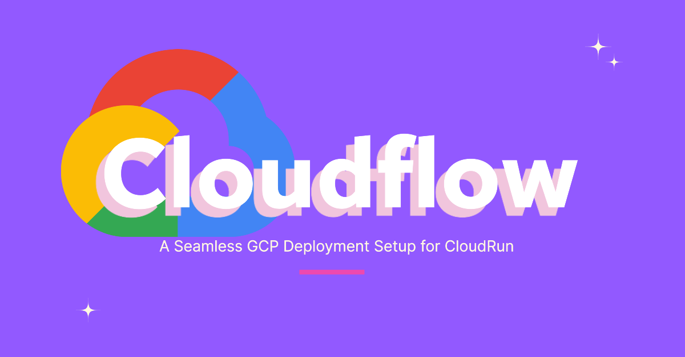

Overview
--------

The pipeline performs the following tasks:

1.  **Build a Docker Image:** Builds a Docker image based on the provided `Dockerfile`.
2.  **Push to Artifact Registry:** Pushes the built image to Google Artifact Registry.
3.  **Deploy to Cloud Run:** Deploys the Docker image to Cloud Run with labels and environment variables.

Configuration Details
---------------------

### Steps

1.  #### Docker Build
    
    Builds the Docker image using [Cloud Build's Docker builder](https://cloud.google.com/cloud-build/docs/building/build-containers).
    
        
        - name: 'gcr.io/cloud-builders/docker'
          args:
            - 'build'
            - '-t'
            - '${_REGION}-docker.pkg.dev/${PROJECT_ID}/${_REPOSITORY_NAME}/${_IMAGE_NAME}:$SHORT_SHA'
            - '-f'
            - '${_DOCKERFILE_RELATIVE_PATH}'
            - '.'
              
    
2.  #### Push Docker Image
    
    Pushes the built image to [Google Artifact Registry](https://cloud.google.com/artifact-registry/docs).
    
        
        - name: 'gcr.io/cloud-builders/docker'
          args:
            - 'push'
            - '${_REGION}-docker.pkg.dev/${PROJECT_ID}/${_REPOSITORY_NAME}/${_IMAGE_NAME}:$SHORT_SHA'
              
    
3.  #### Deploy to Cloud Run
    
    Deploys the Docker image to [Google Cloud Run](https://cloud.google.com/run/docs) with environment variables, labels, and other settings.
    
        
        - name: 'gcr.io/cloud-builders/gcloud'
          args:
            - 'run'
            - 'deploy'
            - '${_SERVICE_NAME}'
            - '--image=${_REGION}-docker.pkg.dev/${PROJECT_ID}/${_REPOSITORY_NAME}/${_IMAGE_NAME}:${SHORT_SHA}'
            - '--region=${_REGION}'
            - '--platform=managed'
            - '--labels=${_LABELS}'
              
    

### Timeout

The build process is limited to a maximum duration of **1500 seconds (25 minutes)**.

### Substitutions

Substitution variables are used to customize the build and deployment process:

    
    _IMAGE_NAME: '[Enter Image Name]'
    _REPOSITORY_NAME: '[Enter Repository Name]'
    _DOCKERFILE_RELATIVE_PATH: './deployment/Dockerfile'
    _SERVICE_NAME: '[Enter Service Name]'
    _LABELS: 'env=production'
    _REGION: 'us-central1'
      

For more information on substitutions, refer to the [Cloud Build Substitution Variables documentation](https://cloud.google.com/cloud-build/docs/configuring-builds/substitute-variable-values).

### Options

Only Cloud Logging is enabled for logging:

    
    options:
      logging: CLOUD_LOGGING_ONLY
      

Learn more about logging options in the [Cloud Build Logging documentation](https://cloud.google.com/cloud-build/docs/configuring-builds/logging).

Getting Started
---------------

Follow these steps to use the pipeline:

1.  Ensure that [Google Cloud SDK](https://cloud.google.com/sdk/docs/install) is installed and authenticated.
2.  Replace the placeholders in the `substitutions` section with actual values.
3.  Run the build using Cloud Build or set up a build trigger in the Cloud Console.

Additional Resources
--------------------

*   [Google Cloud Build Documentation](https://cloud.google.com/cloud-build/docs)
*   [Google Artifact Registry Documentation](https://cloud.google.com/artifact-registry/docs)
*   [Google Cloud Run Documentation](https://cloud.google.com/run/docs)