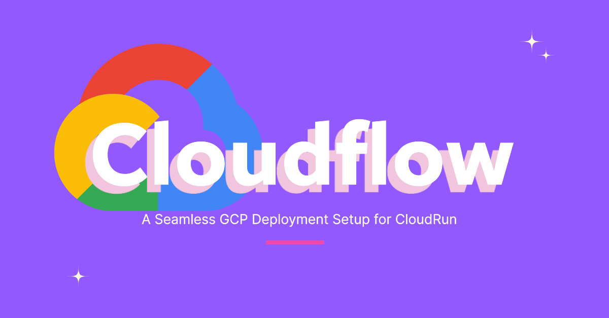

Cloud Build Pipeline for Docker, Cloud Run, and VPC Configuration
=================================================================

This configuration file is designed to automate the process of building a Docker image, pushing it to Google Artifact Registry, deploying it to Google Cloud Run, and configuring the service to use a specific VPC network and subnet.

Overview
--------

The pipeline performs the following tasks:

1.  **Build a Docker Image:** Builds a Docker image from the specified Dockerfile.
2.  **Push to Artifact Registry:** Pushes the built Docker image to Google Artifact Registry.
3.  **Deploy to Cloud Run:** Deploys the Docker image to Google Cloud Run, allowing unauthenticated access, and configures VPC networking settings.

Configuration Details
---------------------

### Steps

1.  #### Docker Build
    
    This step builds the Docker image using the [Cloud Build Docker builder](https://cloud.google.com/cloud-build/docs/building/build-containers) and tags it with the appropriate name and version.
    
        
        - name: 'gcr.io/cloud-builders/docker'
          args:
            - 'build'
            - '-t'
            - '${_REGION}-docker.pkg.dev/${PROJECT_ID}/${_REPOSITORY_NAME}/${_IMAGE_NAME}:$SHORT_SHA'
            - '-f'
            - '${_DOCKERFILE_RELATIVE_PATH}'
            - '.'
              
    
2.  #### Push Docker Image
    
    This step pushes the built Docker image to [Google Artifact Registry](https://cloud.google.com/artifact-registry/docs) for storage and deployment.
    
        
        - name: 'gcr.io/cloud-builders/docker'
          args:
            - 'push'
            - '${_REGION}-docker.pkg.dev/${PROJECT_ID}/${_REPOSITORY_NAME}/${_IMAGE_NAME}:$SHORT_SHA'
              
    
3.  #### Deploy to Cloud Run with VPC Configuration
    
    This step deploys the Docker image to [Google Cloud Run](https://cloud.google.com/run/docs). It allows unauthenticated access and configures VPC networking, including specifying a VPC network, subnet, and VPC egress settings.
    
        
        - name: 'gcr.io/cloud-builders/gcloud'
          args:
            - 'run'
            - 'deploy'
            - '${_SERVICE_NAME}'
            - '--image=${_REGION}-docker.pkg.dev/${PROJECT_ID}/${_REPOSITORY_NAME}/${_IMAGE_NAME}:${SHORT_SHA}'
            - '--region=${_REGION}'
            - '--platform=managed'
            - '--allow-unauthenticated'
            - '--network=projects/${PROJECT_ID}/global/networks/${_VPC_NETWORK_NAME}'
            - '--subnet=projects/${PROJECT_ID}/regions/${_REGION}/subnetworks/${_SUBNET_NAME}'
            - '--vpc-egress=private-ranges-only'
            - '--ingress=all'
            - '--labels=${_LABELS}'
              
    
    For more details, refer to the [Cloud Run VPC Networking documentation](https://cloud.google.com/run/docs/configuring/connecting-vpc).
    

### Timeout

The build process has a timeout of **1500 seconds (25 minutes)**.

### Substitutions

The following substitution variables can be customized:

    
    _IMAGE_NAME: '[Enter here Image Name]'
    _REPOSITORY_NAME: '[Enter here Repository Name]'
    _DOCKERFILE_RELATIVE_PATH: './deployment/Dockerfile'
    _SERVICE_NAME: '[Enter here service name]'
    _LABELS: 'env=production'
    _REGION: 'us-central1'
    _VPC_NETWORK_NAME: '[Enter here vpc network name]'
    _SUBNET_NAME: '[Enter here subnet name]'
      

For more information on substitutions, refer to the [Cloud Build Substitution Variables documentation](https://cloud.google.com/cloud-build/docs/configuring-builds/substitute-variable-values).

### Options

Only Cloud Logging is enabled for logging:

    
    options:
      logging: CLOUD_LOGGING_ONLY
      

Learn more about logging options in the [Cloud Build Logging documentation](https://cloud.google.com/cloud-build/docs/configuring-builds/logging).

Getting Started
---------------

Follow these steps to use the pipeline:

1.  Ensure the [Google Cloud SDK](https://cloud.google.com/sdk/docs/install) is installed and authenticated.
2.  Replace placeholders in the `substitutions` section with your specific project details.
3.  Run the build using Cloud Build or configure a trigger in the Google Cloud Console.

Additional Resources
--------------------

*   [Google Cloud Build Documentation](https://cloud.google.com/cloud-build/docs)
*   [Google Artifact Registry Documentation](https://cloud.google.com/artifact-registry/docs)
*   [Google Cloud Run Documentation](https://cloud.google.com/run/docs)
*   [Cloud Run VPC Networking Documentation](https://cloud.google.com/run/docs/configuring/connecting-vpc)